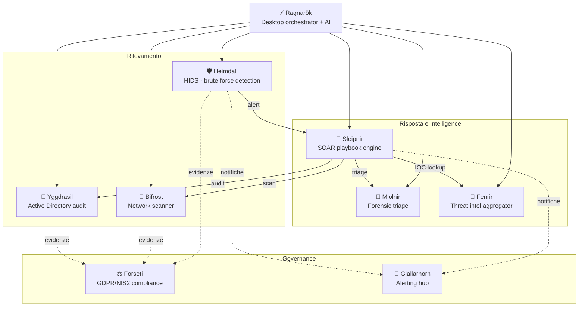
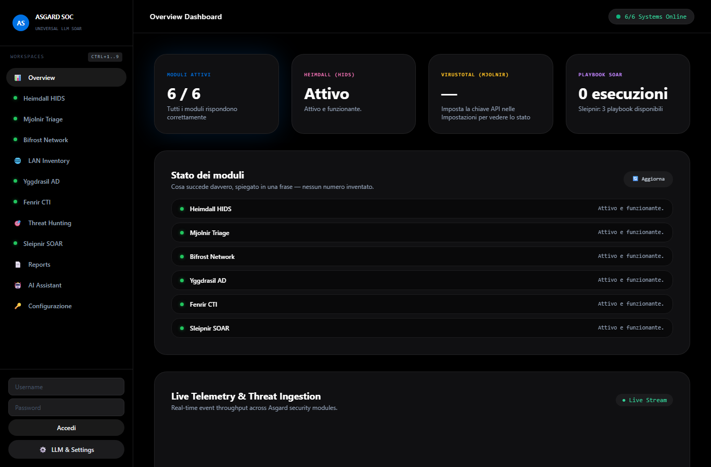
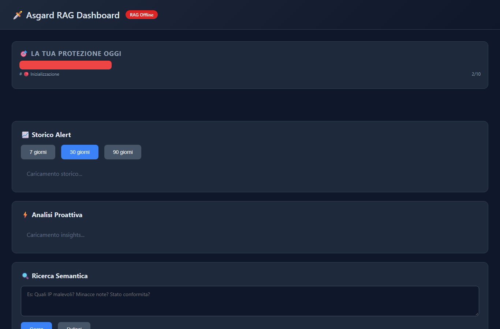
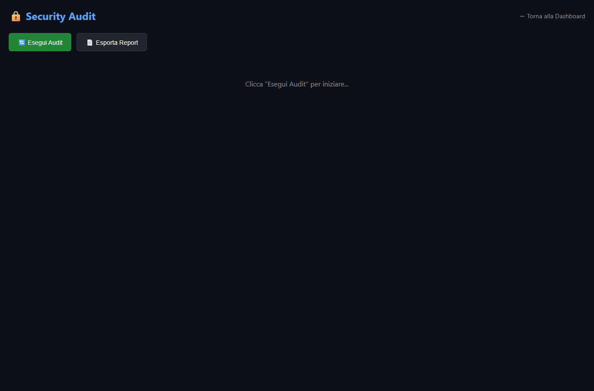

<div align="center">

# ASGARD

### Blue Team Security Suite — 9 moduli, un solo principio: se non è testato, non esiste.


[🇬🇧 English version](README_EN.md)

</div>

---

## Cos'è Asgard

Asgard è una suite di strumenti di sicurezza difensiva (blue team) pensata per PMI e analisti indipendenti che non possono permettersi una piattaforma SOC commerciale, ma hanno comunque bisogno di rilevare, investigare, orchestrare e — sempre più spesso — dimostrare la propria conformità normativa.

Ogni modulo fa **una cosa sola** e la fa bene: nessun monolite, nessuna dipendenza obbligata da un cloud provider, nessuna funzionalità descritta nel README che non esista davvero nel codice. Questo secondo punto non è una frase di circostanza: l'intera suite è passata attraverso un audit tecnico completo (letto ogni file sorgente, non solo la documentazione) che ha corretto bug di sicurezza reali — inclusi due casi in cui il software dichiarava un successo che in realtà non c'era mai stato. Il criterio guida da quel momento in poi è stato uno solo: **funziona davvero, o non è nella suite.**

---

## Architettura



Tre gruppi funzionali:

- **Rilevamento** — i sensori: Heimdall guarda i log, Bifrost guarda la rete, Yggdrasil guarda Active Directory.
- **Risposta e Intelligence** — cosa succede dopo un alert: Mjolnir fa il triage forense dell'host, Fenrir arricchisce con threat intel pubblica, Sleipnir orchestra tutto tramite playbook YAML.
- **Governance** — la parte che di solito manca nei portfolio di sicurezza puramente tecnici: Forseti traduce la postura di sicurezza in uno score di conformità GDPR/NIS2, Gjallarhorn centralizza le notifiche invece di farle reimplementare a ogni modulo.

**Ragnarök** è il punto di comando: un'app desktop (Tauri + FastAPI) con un assistente conversazionale che propone azioni sui moduli sottostanti — mai eseguendole senza una conferma esplicita.

---

## I moduli

| Modulo | Cosa fa | Stack | Test |
|---|---|---|---|
| [**Heimdall**](Heimdall) | HIDS leggero & Windows Agent: rileva brute-force nei log SSH/Windows EventLog, blocca IP a livello firewall con TTL configurabile, notifica via Telegram/Gjallarhorn | Python, PowerShell, FastAPI, SQLite | 38 ✅ |
| [**Mjolnir**](Mjolnir) | Triage forense automatico su host compromesso: snapshot processi/rete, verifica hash su VirusTotal (con cache e rate-limiting), scansione YARA reale (yara-python), report Markdown/HTML | Python, psutil, yara-python | 49 ✅ |
| [**Bifrost**](Bifrost) | Scanner di rete multi-thread con banner grabbing, arricchimento GeoIP/WHOIS, LAN discovery, report cifrati (PBKDF2 + Fernet) | Python, FastAPI | 46 ✅ |
| [**Yggdrasil**](Yggdrasil) | Audit di sicurezza Active Directory (LDAP/LDAPS) e Cloud Microsoft 365 / Entra ID (MFA posture, Global Admins, Legacy Auth) via Microsoft Graph API reale (app-only OAuth2) o export JSON | Python, ldap3, msal | 54 ✅ |
| [**Fenrir**](Fenrir) | Aggregatore di threat intelligence pubblica: CISA KEV sempre attivo, OTX opzionale, esportazione STIX 2.1, SQLite con lock protection | Python | 48 ✅ |
| [**Sleipnir**](Sleipnir) | Motore SOAR: esegue playbook YAML che orchestrano gli altri moduli, con stato persistente e audit trail dell'incidente | Python, PyYAML | 32 ✅ |
| [**Forseti**](Forseti) | Compliance checker GDPR/NIS2/DORA/ISO27001 per PMI: 41 controlli reali (13 GDPR + 12 NIS2 + 8 DORA + 8 ISO27001), scoring, report con gap e remediation concrete | Python | 44 ✅ |
| [**Gjallarhorn**](Gjallarhorn) | Hub di alerting centralizzato (Telegram/webhook/SMTP/Teams/Jira/ServiceNow) con dedup e throttling, usato da Heimdall e Sleipnir | Python, FastAPI | 63 ✅ |
| [**Ragnarök**](Ragnarok) | Desktop & Web orchestrator (Tauri + FastAPI) con assistente AI (FastEmbed + ChromaDB), RBAC multi-utente, security hardening e audit log | Tauri, Rust, Python | 264 ✅ |

---

## Screenshot (dal vivo, `http://localhost:8080`)

| Console SOC | Dashboard RAG | Security Audit |
|---|---|---|
|  |  |  |
| 6/6 moduli online, stato in una frase | Score, timeline, ricerca semantica | Audit on-demand, export report |

---

## Esecuzione e Verifica Automatica dell'Intera Suite

Puoi verificare l'intera suite con il test runner unificato:

```bash
python run_suite_tests.py
# Per testare un singolo modulo:
python run_suite_tests.py -m Heimdall
```

---

## Quick Start (Docker — Full Suite)

The 9 modules are git submodules, not plain folders — clone with `--recursive`,
or the module directories will be empty and both the Docker build and
`install.sh`/`install.ps1` will fail.

```bash
# Clone the repository AND its 9 module submodules in one step
git clone --recursive https://github.com/Fioru12/Asgard.git
cd Asgard

# Already cloned without --recursive? Fetch the submodules now:
# git submodule update --init --recursive

# Build and start all 9 modules with one command:
./install.sh            # Linux / macOS / Git Bash
.\install.ps1           # Windows PowerShell
```

Then open **http://localhost:8080/dashboard** — the first-launch wizard will guide you through creating the admin account.

Services exposed on localhost:

| Service | URL |
|---------|-----|
| Ragnarök (dashboard + API) | http://localhost:8080 |
| Heimdall | http://localhost:18000 |
| Gjallarhorn | http://localhost:8090 |
| Forseti | http://localhost:8091 |
| Bifrost | http://localhost:8092 |

---

## Quick Start (Manual — Single Module)

Every module is independent: clone it, install it, use it on its own.

```bash
git clone https://github.com/Fioru12/<Modulo>.git
cd <Modulo>
pip install -r requirements.txt
pytest -v          # verifica che tutto funzioni nel tuo ambiente
python main.py --help
```

Ogni modulo ha il proprio `README.md` con Quick Start specifico, `.env.example` per la configurazione, e una sezione "Perché l'ho costruito" che spiega il problema reale a cui risponde — non è farina di un solo giorno, è la storia di come la suite si è evoluta un modulo alla volta.

---

## Principi di progetto

- **Zero funzionalità aspirazionali.** Se il README di un modulo descrive qualcosa, quel qualcosa ha un test che lo dimostra. Dove un modulo supporta una modalità dimostrativa/simulata (es. Yggdrasil senza un vero Active Directory a disposizione), è dichiarato esplicitamente, mai spacciato per dato reale.
- **Fallire in modo rumoroso, non silenzioso.** Un'azione di sicurezza che fallisce (un blocco firewall, una query LDAP, una notifica) lo dice chiaramente — non finge un successo che non c'è.
- **Autenticazione di default su ogni API esposta**, chiave generata automaticamente se non configurata esplicitamente, mai un endpoint aperto per dimenticanza.
- **Un umano resta nel loop** per ogni azione con conseguenze reali (blocco IP, esecuzione playbook, azione proposta dall'AI in Ragnarök).

---

<div align="center">

**Sviluppato da [Fioru12](https://github.com/Fioru12)**

</div>
