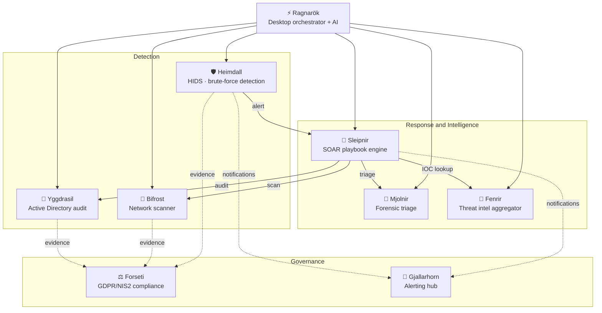

<div align="center">

# ASGARD

### Blue Team Security Suite — 9 modules, one principle: if it isn't tested, it doesn't exist.


[🇮🇹 Versione italiana](README.md)

</div>

---

## What is Asgard

Asgard is a suite of defensive security (blue team) tools designed for small businesses and independent analysts who cannot afford a commercial SOC platform, yet still need to detect, investigate, orchestrate and — increasingly often — demonstrate regulatory compliance.

Every module does **one thing** and does it well: no monoliths, no forced dependency on a cloud provider, no feature described in a README that doesn't actually exist in the code. That last point is not a throwaway sentence: the entire suite went through a full technical audit (every source file read, not just the documentation) which fixed real security bugs — including two cases where the software claimed a success that had never actually happened. The guiding criterion since then has been a single one: **it really works, or it isn't in the suite.**

---

## Architecture



Three functional groups:

- **Detection** — the sensors: Heimdall watches the logs, Bifrost watches the network, Yggdrasil watches Active Directory.
- **Response and Intelligence** — what happens after an alert: Mjolnir performs forensic triage on the host, Fenrir enriches with public threat intel, Sleipnir orchestrates everything through YAML playbooks.
- **Governance** — the part usually missing from purely technical security portfolios: Forseti translates security posture into a GDPR/NIS2 compliance score, Gjallarhorn centralizes notifications instead of letting every module reimplement them.

---

## The Modules

| Module | What it does | Stack | Tests |
|---|---|---|---|
| [**Heimdall**](Heimdall) | Lightweight HIDS & Windows Agent: detects brute-force in SSH/Windows EventLog, blocks IPs at the firewall level with configurable TTL, notifies via Telegram/Gjallarhorn | Python, PowerShell, FastAPI, SQLite | 38 ✅ |
| [**Mjolnir**](Mjolnir) | Automated forensic triage on a compromised host: process/network snapshots, hash lookups on VirusTotal (with caching and rate-limiting), real YARA scanning (yara-python), Markdown/HTML reports | Python, psutil, yara-python | 49 ✅ |
| [**Bifrost**](Bifrost) | Multi-threaded network scanner with banner grabbing, GeoIP/WHOIS enrichment, LAN discovery, encrypted reports (PBKDF2 + Fernet) | Python, FastAPI | 46 ✅ |
| [**Yggdrasil**](Yggdrasil) | Active Directory (LDAP/LDAPS) & Microsoft 365 / Entra ID cloud security posture audit (MFA enforcement, Global Admins, Legacy Auth) via real Microsoft Graph API (app-only OAuth2) or JSON export | Python, ldap3, msal | 54 ✅ |
| [**Fenrir**](Fenrir) | Public threat intelligence aggregator: CISA KEV always on, optional OTX, STIX 2.1 exporter, local SQLite with stale lock protection | Python | 48 ✅ |
| [**Sleipnir**](Sleipnir) | SOAR engine: runs YAML playbooks that orchestrate the other modules, with persistent state and an incident audit trail | Python, PyYAML | 32 ✅ |
| [**Forseti**](Forseti) | GDPR/NIS2/DORA/ISO27001 compliance checker for SMBs: 31 real controls (13 GDPR + 12 NIS2 + 3 DORA + 3 ISO27001), scoring, report with gaps and concrete remediations | Python | 44 ✅ |
| [**Gjallarhorn**](Gjallarhorn) | Centralized alerting hub (Telegram/webhook/SMTP/Teams/Jira/ServiceNow) with dedup and throttling, used by Heimdall and Sleipnir | Python, FastAPI | 63 ✅ |
| [**Ragnarök**](Ragnarok) | Desktop & Web SOC orchestrator (Tauri + FastAPI) with AI assistant (FastEmbed + ChromaDB), multi-user RBAC, and audit log | Tauri, Rust, Python | 264 ✅ |

---

## Global Test Runner & Verification

You can verify the entire 9-module suite using the unified test runner:

```bash
python run_suite_tests.py
# Or verify a specific module:
python run_suite_tests.py -m Heimdall
```

---

## Quick start for any module

```bash
git clone https://github.com/Fioru12/<Module>.git
cd <Module>
pip install -r requirements.txt
pytest -v          # verify everything works in your environment
python main.py --help
```

Every module has its own `README.md` with a specific Quick Start, a `.env.example` for configuration, and a "Why I built it" section explaining the real problem it answers — this isn't a one-day effort, it's the story of how the suite evolved one module at a time.

---

## Project principles

- **Zero aspirational features.** If a module's README describes something, that something has a test proving it. Where a module supports a demo/simulated mode (e.g. Yggdrasil without a real Active Directory available), it is stated explicitly — never passed off as real data.
- **Fail loudly, not silently.** A security action that fails (a firewall block, an LDAP query, a notification) says so clearly — it never fakes a success.
- **Authentication by default on every exposed API**: a key is generated automatically if not configured explicitly; there is never an open endpoint by oversight.
- **A human stays in the loop** for every action with real consequences (IP blocking, playbook execution, AI-proposed actions in Ragnarök).

---

<div align="center">

**Built by [Fioru12](https://github.com/Fioru12)**

</div>
